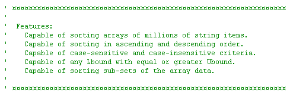

<div align="center">

## Extremely Fast Case\-Insensitive Unicode String Array Sorting Class


</div>

### Description

Extremely Fast Case-Insensitive Unicode String Array Sorting Class (Revision II)

----

This string sorting class is extremely fast at case-insensitive sorting operations due to the

combination of a highly optimized Blizzard quicksort algorithm, extremely fast in-place

unicode comparison thanks to Ralph Eastwood, and a unique textual compare lookup table that is built only once at initialization in just over one hundredth of a second thanks to LukeH, and stored in a long array which is accessed in-line to minimize the case-conversion impact on this supremely fast comparison algorithm. Its performance on case-insensitive operations is only slightly slower than its case-sensitive binary compare operations, and is well over two times faster than StrComp's textual compare mode when used within the very same algorithm. Turning off strict compatibility with VB's StrComp function will improve performance on case-insensitive operations even further.

----

Special thanks to the following for their generous contribution

to this sorting class:


----

QuickSort Origins ~ C.A.R. Hoare 

----

String Comparison ~ Ralph Eastwood (tcm) 

----

LowerCase Conversion ~ LukeH (selftaught) 

----

SafeArray Substitution ~ Luke, Ralph, & Rd

----

Blizzard quicksort algorithm and in-line lookup table by Rd :)

----

Revision I - Fixed potential bug! Added demo project.

----

Revision II - Fixed null-string descending bug!
 
### More Info
 


<span>             |<span>
---                |---
**Submitted On**   |2011-05-28 16:50:16
**By**             |[Rde](https://github.com/Planet-Source-Code/PSCIndex/blob/master/ByAuthor/rde.md)
**Level**          |Advanced
**User Rating**    |5.0 (40 globes from 8 users)
**Compatibility**  |VB 4\.0 \(32\-bit\), VB 5\.0, VB 6\.0
**Category**       |[String Manipulation](https://github.com/Planet-Source-Code/PSCIndex/blob/master/ByCategory/string-manipulation__1-5.md)
**World**          |[Visual Basic](https://github.com/Planet-Source-Code/PSCIndex/blob/master/ByWorld/visual-basic.md)
**Archive File**   |[Extremely\_22132110192011\.zip](https://github.com/Planet-Source-Code/rde-extremely-fast-case-insensitive-unicode-string-array-sorting-class__1-72576/archive/master.zip)

### API Declarations

```
' Array boundaries and data type limits
' are carefully managed in this class.
' There-fore, advanced compiler
' optimizations can be set however
' you see fit, with one exception -
' this class will error if you set
' the Assume No Aliasing option.
```


